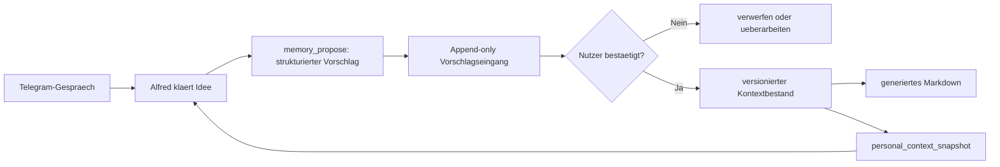

# Alfred – flexibles und sicheres Langzeitgedaechtnis

Status: am 22. Juli 2026 produktiv umgesetzt und abgenommen

## 1. Ziel

Alfred soll wie ein langfristiger Gespraechspartner arbeiten: neue
Anschaffungen, Ziele, Entscheidungen und Strategiewechsel gemeinsam mit dem
Nutzer entwickeln, spaeter wiederfinden und bei kuenftigen Empfehlungen
beruecksichtigen. Der bestaetigte Finanzrahmen bleibt eine veraenderbare
Ausgangslage und kein starres Regelbuch.

Alfred erhaelt dafuer keinen allgemeinen Datei- oder Shellzugriff. Markdown ist
das lesbare Speicherformat, aber ein eng begrenztes Werkzeug erzeugt und
versioniert die Dateien aus validierten Feldern.

## 2. Produktiver Stand

Der bestaetigte Grundkontext liegt in `USER.md` und `MEMORY.md`. Spaetere
Langzeiterinnerungen liest Alfred ueber `personal_context_snapshot`. Er kann
mit `memory_propose` strukturierte Aenderungen vorschlagen; dauerhaft wirksam
werden sie erst nach einer neuen ausdruecklichen Bestaetigung des gekoppelten
Eigentuemers ueber `memory_confirm`.

Der kanonische Store liegt auf dem Hetzner-Server unter
`/var/lib/alfred/personal-context/`. Das root-eigene Plugin liegt unter
`/opt/alfred-memory-tool/`. Markdown-Dateien werden deterministisch aus dem
validierten Store erzeugt. Alfred besitzt weiterhin keinen allgemeinen Datei-
oder Shellzugriff.

## 3. Zielarchitektur



### `memory_propose`

Das Werkzeug akzeptiert nur ein festes Schema:

- Typ: `purchase`, `goal`, `workflow`, `strategy`, `household`, `preference`
  oder `decision`;
- Titel und kurze Zusammenfassung;
- Status: Idee, Pruefung oder zur Bestaetigung bereit;
- Kostenrahmen, Zielzeitraum und Prioritaet, soweit relevant;
- betroffene bestehende Ziele;
- Quelle und Erstellungsdatum;
- optionale ID einer Entscheidung, die ersetzt werden soll.

Es schreibt ausschliesslich neue Vorschlaege in einen festen Eingang. Freie
Dateipfade, Dateinamen, Markdown-Anweisungen und Aenderungen bestehender
Konfigurationsdateien sind ausgeschlossen.

### Bestaetigung und Aenderung

Alfred zeigt vor der Uebernahme eine kompakte Zusammenfassung. Erst eine neue,
ausdrueckliche Nutzerantwort wie „Ja, dauerhaft merken“ darf den Vorschlag
freigeben. Eine Bestaetigung erzeugt eine neue Revision; alte Entscheidungen
werden nicht unsichtbar ueberschrieben, sondern mit `supersededBy` abgeloest.

Der Nutzer kann Erinnerungen anzeigen, korrigieren, archivieren oder loeschen.
Eine Strategieaenderung bekommt Geltungsdatum und Begruendung, damit Alfred
nicht spaeter mit ueberholten Zielen argumentiert.

### Speicherung und Abruf

Die kanonischen Daten liegen strukturiert und versioniert vor. Daraus werden
menschenlesbare Markdown-Dateien erzeugt, beispielsweise:

```text
context/
  goals.md
  planned-purchases.md
  investment-policy.md
  household.md
  decision-history.md
```

Alfred liest nicht beliebige Dateien. Das feste Read-only-Werkzeug
`personal_context_snapshot` bietet nur Ansichten wie `goals`, `purchases`,
`strategy`, `household`, `history` und `pending`. Dadurch bleiben Groesse,
Datenqualitaet und Prompt-Injection-Schutz kontrollierbar.

## 4. Beispiel: Wischroboter oder Tiefkuehltruhe

Eine beiläufige Erwaehnung wird nicht sofort zum Sparziel. Alfred fragt je nach
Entscheidungsrelevanz nach:

- ungefaehrem Kostenrahmen;
- gewuenschtem Zeitraum;
- Zweck und erwarteter Zeit- oder Kostenersparnis;
- Prioritaet gegenueber Notgroschen, Urlaub, Eigenheim und Depot;
- Finanzierung aus Monatsbudget oder eigenem Spartopf.

Danach fasst Alfred den Plan zusammen und fragt, ob er ihn dauerhaft merken
soll. Erst die Bestaetigung erstellt oder aktualisiert den Eintrag.

## 5. Sicherheitsgrenzen

- kein allgemeiner Schreib-, Datei- oder Shellzugriff fuer Alfred;
- niemals Zugriff auf Tokens, Passwoerter oder Bankzugangsdaten;
- keine Aenderung an `AGENTS.md`, `SOUL.md`, `TOOLS.md`, `IDENTITY.md` oder
  OpenClaw-Konfiguration durch ein Gedaechtniswerkzeug;
- atomare Writes, Schema-Pruefung, Groessenlimits und unveraenderbares
  Aenderungsprotokoll;
- keine dauerhafte Speicherung von Kontostaenden, Einzelbuchungen oder
  Portfolio-Snapshots;
- getrennte Sicherung und vollstaendige Export-/Loeschmoeglichkeit.

## 6. Umgesetzte Funktionen

1. Read-only `personal_context_snapshot` fuer bestaetigte Ziele,
   Anschaffungen, Strategie und Historie.
2. Append-only `memory_propose` mit Telegram-tauglicher Zusammenfassung und
   ausdruecklicher Bestaetigung.
3. Kontrollierte Funktionen fuer Bestaetigen, Ersetzen, Archivieren und
   Loeschen sowie Markdown-Generierung und Backup.

Die Werkzeuge sind unter `alfred/stage4/memory/` implementiert und produktiv
geladen. Geprueft wurden:

- schreibfreier Abruf durch Alfred;
- Vorschlag ohne automatische Uebernahme;
- Ablehnung einer Bestaetigung aus einem nicht als Eigentuemer gekoppelten
  lokalen Serverkontext;
- Erstellen und anschliessendes `forget` eines harmlosen Testeintrags mit dem
  produktiv deployten Speicherbaustein;
- Store-Integritaet, atomare Markdown-Neugenerierung und Entfernung des
  Testtexts aus Store, Markdown und Ereignisprotokoll;
- leere produktive Ausgangslage nach dem Test: Revision 2, null aktive und
  null ausstehende Eintraege;
- Agententrennung: Nur `main` besitzt die Gedaechtniswerkzeuge, Serverwart
  erhaelt sie nicht.

Normale Infrastruktur-Backups koennen vergessene Inhalte bis zum Ende ihrer
Aufbewahrungsfrist enthalten. Im aktiven Store und in den generierten Ansichten
werden sie durch `forget` entfernt.
