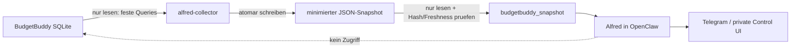

# Alfred – Stufe 2: BudgetBuddy Read-only-Datenadapter

Status: technisch produktiv; Fixkostenvertrag am 4. August 2026 fuer FIN-126 praezisiert

## 1. Ergebnis

Alfred kann ueber Webchat und Telegram aktuelle, aggregierte BudgetBuddy-Daten
als ehrliche zweite Meinung verwenden. Es gibt keine neue fachliche App und
keine manuelle JSON-Pflege. Ein deterministischer Collector aktualisiert die
Daten automatisch alle 15 Minuten; nur eine echte Beratung erzeugt einen
Modellturn.

Stufe 2 umfasst ausschliesslich BudgetBuddy. Getquin, Aktien, Edelmetalle,
Marktpreise, Ziele, automatische Wochenberichte und Heartbeats folgen spaeter.

Der anschliessend umgesetzte Getquin-Portfolioadapter ist in
`docs/alfred-stufe-3-getquin-plan.md` dokumentiert.

## 2. Sicherheitsarchitektur



Die Betriebssystemgrenzen sind wichtiger als der Prompt:

| Identitaet | BudgetBuddy-Datenbank | Snapshot | Aufgabe |
| --- | --- | --- | --- |
| `budgetbuddy` | lesen und schreiben | kein Bedarf | Produktiv-App |
| `alfred-collector` | nur lesen | schreiben | feste Aggregate erzeugen |
| `alfred` | kein Zugriff | nur lesen | Snapshot pruefen und beraten |

Der Collector laeuft als gehaerteter `systemd`-Oneshot mit
`ProtectSystem=strict`, leerer Capability-Liste, `NoNewPrivileges=true`, nur
`AF_UNIX` und einem Schreibpfad ausschliesslich fuer Snapshots. OpenClaw sieht
den Snapshot als zusaetzlichen `ReadOnlyPaths`-Pfad.

## 3. Snapshot-Vertrag

Vertrag: `budgetbuddy.coach.snapshot.v2`
Query-Katalog: `2026-08-04.1`
Unterstuetztes BudgetBuddy-Schema: `0020_fin_126`

Der Snapshot enthaelt:

- bis zu 13 Monate mit Einnahmen, Einkommensabzuegen, Rueckerstattungen,
  Ausgaben, Sparanteil, Cashflow und offenen Zuordnungen;
- 12 ISO-Wochen fuer kurzfristige Trends;
- aggregierte Ausgaben je Kategorie sowie geplante Kategorie- und
  Sonderbudgets;
- aktuelle einzelne Fixkosten-Planpositionen mit Betrag und Abbuchungstag;
- geplante Fixkosten aus eingefrorenen Monatsabschluss-Snapshots
  beziehungsweise der aktuellen Fixkostenplanung;
- aggregierte persistierte Fixkosten-Kontrollbuchungen aus expliziten
  Importregeln und manuellen Markierungen; der aus Kompatibilitaetsgruenden
  weiter enthaltene Zaehler `automaticDirect` bleibt null;
- getrennte Werte fuer alle gebuchten Ausgaben, erkannte Fixkosten und die
  danach verbleibenden variablen Ausgaben;
- berechnete BudgetBuddy-Kontostaende;
- Datenqualitaet, Zeitraum, Quellschema, Erfassungszeit und Datenhash.

Nicht enthalten sind:

- Transaktions-IDs und einzelne Buchungszeilen;
- Verwendungszwecke und Beschreibungen;
- Gegenparteien und IBANs;
- Import-Fingerprints und Import-Rohdaten;
- Notizen, Zugangsdaten oder Telegram-Inhalte.

Betragswerte liegen als Integer-Cent vor. Kategorienamen und andere Labels
gelten fuer das Modell als nicht vertrauenswuerdige Daten und niemals als
Anweisungen.

## 4. OpenClaw-Werkzeug

Alfred erhaelt genau ein neues Werkzeug:

```text
budgetbuddy_snapshot(view)
view = overview | months | weeks | fixed_costs | quality | full
```

Der Dateipfad ist serverseitig fest konfiguriert. Das Werkzeug akzeptiert
weder SQL noch einen freien Pfad. Vor der Ausgabe prueft es:

1. regulaere, nicht per Symlink umgeleitete Datei;
2. maximale Dateigroesse und nicht schreibbare Gruppen-/Weltrechte;
3. Vertrags- und Quellenmetadaten;
4. SHA-256-Integritaet;
5. Erfassungszeit und maximale Frische von 45 Minuten.

Alfred muss vor Aussagen zu BudgetBuddy-Zahlen die kleinste passende Ansicht
laden, den Datenstand nennen und relevante `dataQuality`-Warnungen
beruecksichtigen. Bei Fehler oder veraltetem Snapshot darf er keine aktuellen
Fakten erfinden.

Bei Fixkostenfragen verwendet Alfred `fixed_costs`. `plannedCents` ist der
Planblock, `actualControlCents` sind bisher erkannte gebuchte Fixkosten,
`totalExpenseCents` enthaelt alle gebuchten Ausgaben und `expenseCents` nur die
nach Herausnahme erkannter Fixkosten verbleibenden variablen Ausgaben. Dadurch
darf der Planblock nicht mehr versehentlich ein zweites Mal von bereits
gebuchten Fixkosten abgezogen werden.

## 5. Produktionspfade und Dienste

```text
/opt/alfred-budgetbuddy-reader/                  root-eigener Collector
/opt/alfred-budgetbuddy-tool/                    root-eigenes OpenClaw-Plugin
/var/lib/alfred-snapshots/budgetbuddy/latest.json
/var/lib/alfred-snapshots/budgetbuddy/history/
/etc/systemd/system/alfred-budgetbuddy-collector.service
/etc/systemd/system/alfred-budgetbuddy-collector.timer
```

Der Timer startet zwei Minuten nach dem Boot, danach alle 15 Minuten mit
kleinem Zufallsversatz. Eine Historienversion entsteht nur, wenn sich der
Finanzdatenhash aendert; maximal 120 Versionen bleiben erhalten.

## 6. Betrieb

Status und naechsten Lauf pruefen:

```bash
ssh root@apps-prod-01 systemctl status alfred-budgetbuddy-collector.timer
ssh root@apps-prod-01 systemctl list-timers alfred-budgetbuddy-collector.timer
```

Collector bewusst sofort ausfuehren und nur technische Logs ansehen:

```bash
ssh root@apps-prod-01 systemctl start alfred-budgetbuddy-collector.service
ssh root@apps-prod-01 journalctl -u alfred-budgetbuddy-collector.service -n 30 --no-pager
```

Alfred und Telegram pruefen:

```bash
ssh root@apps-prod-01 alfredctl status
ssh root@apps-prod-01 alfredctl telegram-status
ssh root@apps-prod-01 alfredctl audit
```

Eine normale Nutzerpruefung in Telegram lautet beispielsweise:

> Alfred, analysiere meinen aktuellen Monat in BudgetBuddy. Nenne zuerst den
> Datenstand und Datenqualitaetsprobleme, dann deine drei wichtigsten
> Beobachtungen. Erfinde nichts, was der Snapshot nicht hergibt.

## 7. Abnahme am 15. und 22. Juli 2026

Erfolgreich geprueft wurden:

- frisches SQLite-Backup plus `PRAGMA integrity_check = ok` vor der
  Berechtigungsaenderung;
- BudgetBuddy-Dienst und HTTP-Endpunkt vor und nach dem Rollout;
- SQLite `readonly`, `fileMustExist` und `query_only`;
- unbekanntes Schema wird abgelehnt;
- Rohfelder verlassen die Datenbank nicht;
- atomare Ausgabe und deduplizierte Historie;
- manipulierte oder veraltete Snapshots werden abgelehnt;
- `alfred-collector` kann lesen, aber nicht in die Datenbank schreiben;
- `alfred` kann die Datenbank nicht lesen und den Snapshot nicht schreiben;
- Collector kann Alfreds privaten Workspace nicht lesen;
- OpenClaw-Plugin geladen, Plugin-Doctor ohne Pluginfehler;
- Modellkontext enthaelt nur `session_status` und `budgetbuddy_snapshot`;
- echter Agent-Turn ruft das Werkzeug auf, nennt `capturedAt`, meldet den
  Datenqualitaetscode `UNASSIGNED_EXPENSES` und bestaetigt fehlenden direkten
  Datenbankzugriff;
- Telegram ist nach dem Neustart verbunden;
- OpenClaw Security Audit: `0 critical`, ein bereits bekannter Deep-Probe-
  Warnhinweis wegen fehlendem `operator.read`-Scope;
- `systemd-analyze security`: Collector `3.0 OK`, OpenClaw `3.2 OK`.
- Snapshot v2 gegen die produktive Datenbank mit `readonly` und
  `query_only` erzeugt und durch das Plugin verifiziert;
- 26 aktive Fixkostenpositionen und deren Abbuchungstagsabdeckung werden
  bereitgestellt, ohne Buchungstexte oder Gegenparteien zu exportieren;
- aktuelle Plan-, Ist-Kontroll-, Gesamt- und variable Ausgabensummen werden
  getrennt geliefert;
- manuelle Include-/Exclude-Overrides und ein absichtlich leerer historischer
  Fixkosten-Snapshot sind automatisiert getestet.
- Fixkosten-Stammdaten erzeugen ohne explizite Kontrollregel keinen Treffer;
  persistierte Treffer bleiben bei spaeteren Regelaenderungen stabil.

Die lokalen automatisierten Tests liegen in
`tests/alfred-budgetbuddy-collector.test.ts` und
`tests/alfred-budgetbuddy-plugin.test.ts`.

## 8. Bekannte Grenzen

- Die Fixkosten-Ist-Sicht ist eine Kontrollauswertung erkannter Buchungen. Sie
  ist keine Garantie, dass jede tatsaechliche Abbuchung erkannt wurde, und
  ordnet Sammelkontrolltreffer nicht zwingend einer einzelnen Planposition zu.
- Der Snapshot kennzeichnet Fremdwaehrungen als Datenqualitaetsproblem; eine
  Wechselkursbewertung ist noch nicht enthalten.
- Einzelne Haendler, Buchungstexte oder konkrete Transaktionen sind aus
  Datenschutzgruenden nicht analysierbar.
- Getquin, Depotallokation und Vermoegenswerte fehlen noch; deshalb kann Alfred
  in Stufe 2 noch kein Gesamtvermoegen oder Portfoliorisiko beurteilen.
- Telegram ist ein Cloud-Chat. Zugangsdaten, TANs und vollstaendige IBANs
  gehoeren weiterhin nicht in den Dialog.
- Es gibt noch keine ungefragten Wochenberichte oder Heartbeats. Alfred
  reagiert auf Nutzerfragen.
- `openclaw doctor` empfiehlt fuer explizite Telegram-Aktionen das allgemeine
  `message`-Werkzeug. Es bleibt absichtlich gesperrt; normale Antworten auf
  eingehende Telegram-Nachrichten funktionieren trotzdem.
- Der Doctor kennzeichnet `gateway.auth.token` vorsorglich als
  secret-tragenden Konfigurationspfad. Produktiv steht dort nur die
  Umgebungsreferenz; der echte Wert bleibt in der geschuetzten Secret-Datei.

## 9. Fehler- und Rueckfallverhalten

Bei Collectorfehlern bleibt der letzte gueltige Snapshot bestehen. Nach 45
Minuten lehnt das Tool ihn als veraltet ab, anstatt alte Werte still als
aktuell auszugeben. Diagnose erfolgt ueber Collector-Journal und
BudgetBuddy-Schemaversion.

Zum sofortigen Abschalten des Datenflusses wird zuerst der Timer deaktiviert
und das Plugin anschliessend in OpenClaw deaktiviert. BudgetBuddy selbst muss
dabei nicht gestoppt oder veraendert werden. Vor Stufe 2 wurde zusaetzlich eine
geschuetzte OpenClaw-Konfigurationskopie erstellt.

Die Architekturentscheidung ist in
`docs/adr/0012-alfred-budgetbuddy-readonly-snapshots.md` festgehalten.
