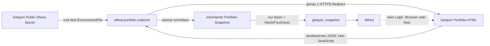

# Alfred – Stufe 3: Getquin Read-only-Portfolioadapter

Status: technisch produktiv und Ende-zu-Ende getestet, 19. Juli 2026

## 1. Ergebnis

Alfred kann im privaten Webchat und in Telegram den aktuellen Stand des ueber
Getquin freigegebenen Portfolios analysieren. Der Collector arbeitet ohne
Login, ohne API-Schluessel, ohne Headless-Browser und ohne Modellturn. Er
aktualisiert den Snapshot taeglich; Alfred selbst erhaelt kein Netzwerk- oder
Browserwerkzeug.

Der aktuelle Live-Vertrag liefert 13 offene Positionen in drei Assetklassen.
Der produktive Snapshot enthielt bei der Abnahme keine Datenqualitaetswarnung.
Diese Zahlen sind nur ein Abnahmezeitpunkt und keine fest codierte Erwartung.

## 2. Sicherheitsarchitektur



| Identitaet | Share-Secret | Getquin-Netz | Snapshot | Andere Alfred-Daten |
| --- | --- | --- | --- | --- |
| `root` / systemd | lesen | kein Collectorbetrieb | administrieren | administrieren |
| `alfred-portfolio-collector` | nur als Prozess-Environment | eng validierter HTTPS-Abruf | schreiben | kein Zugriff |
| `alfred` | kein Zugriff | kein Zugriff | nur lesen | eigene freigegebene Tools |

Das Secret ist `root:root 0600`. Selbst der Collector-Prozess kann die Datei
nicht direkt lesen; systemd liest sie vor dem Benutzerwechsel und uebergibt
nur die Umgebungsvariable. Das Secret wird nie ausgegeben.

## 3. Warum kein Headless-Browser

Die aktuelle Public-Share-Seite enthaelt den Portfoliozustand bereits im
serverseitigen Next.js-Dokument. Der Collector verarbeitet ausschliesslich das
JSON aus `__NEXT_DATA__`.

Dadurch entfallen:

- Chromium und dessen Patch-/Sandboxbetrieb;
- Ausfuehrung fremder Skripte und Community-Inhalte;
- ein persistentes Browserprofil, Cookies oder Local Storage;
- Screenshots und visuelles Raten bei Layoutaenderungen;
- zusaetzliche Domains fuer Analytics, Bilder und WebSockets.

Der Collector akzeptiert nur:

1. die konfigurierte HTTPS-Share-URL unter `getqu.in`;
2. einen Redirectstatus;
3. ein HTTPS-Ziel unter `app.getquin.com` mit dem Muster
   `/<sprache>/dashboard/<id>`;
4. die bekannten Queryfelder `lang`, `utm_campaign`, `utm_medium` und
   `utm_source`;
5. eine einzelne HTML-Antwort von maximal zwei Megabyte.

## 4. Snapshot-Vertrag

Vertrag: `getquin.portfolio.snapshot.v1`
Extractor: `2026-07-19.1`
Waehrung: EUR

Enthalten:

- Anzahl aktueller und beobachteter geschlossener Positionen;
- fruehestes sichtbares Investmentdatum;
- aktueller Portfoliowert aus Stueckzahl mal letztem sichtbaren EUR-Kurs;
- sichtbare Kostenbasis und daraus abgeleitetes nicht realisiertes Ergebnis;
- sichtbare kumulierte Dividenden, Zinsen, Kosten und Steuern;
- je offener Position Name, Ticker, Symbol, Assetklasse, Stueckzahl,
  Kurszeitpunkt, aktueller Wert, Kostenbasis und nicht realisiertes Ergebnis;
- Assetklassen-Allokation;
- Top-1-, Top-3- und Top-5-Konzentration sowie Herfindahl-Index;
- aeltester und neuester Kurszeitpunkt, Warnungen und methodische Grenzen;
- SHA-256-Datenhash.

Ausgeschlossen:

- Share-URL und Share-ID;
- Profil-ID, Profilname, Benutzername und Avatar;
- Login-, Cookie- oder Browserdaten;
- Getquin-Runtime-Konfiguration;
- Community-Posts und andere Freitexte;
- geschlossene Einzelpositionen und Transaktionshistorie.

Instrumentnamen gelten als nicht vertrauenswuerdige Daten und niemals als
Anweisungen.

## 5. Renditegrenze

Der Snapshot darf folgende Aussagen stuetzen:

- aktueller Wert und sichtbare Kostenbasis;
- nicht realisierter Gewinn oder Verlust je Position und gesamt;
- aktuelle Allokation und Konzentration;
- sichtbare kumulierte Dividenden;
- Veraenderungen zwischen datierten Bestands-Snapshots.

Er darf ohne Investmenttransaktionen und Cashflows nicht als Beleg fuer
zeitgewichtete Rendite, persoenliche geldgewichtete Rendite oder vollstaendige
Gesamtperformance verwendet werden. Ein hoeherer Portfoliowert kann ebenso aus
Einzahlungen oder Kaeufen stammen.

## 6. Produktionspfade und Taktung

```text
/opt/alfred-getquin-reader/
/opt/alfred-getquin-tool/
/var/lib/alfred/secrets/getquin.env
/var/lib/alfred-snapshots/getquin/latest.json
/var/lib/alfred-snapshots/getquin/history/
/etc/systemd/system/alfred-getquin-collector.service
/etc/systemd/system/alfred-getquin-collector.timer
```

Der Collector laeuft nach dem Boot und danach taeglich um 06:15 Uhr
`Europe/Berlin` mit bis zu fuenf Minuten Zufallsversatz. Maximal 400
unterschiedliche Historienstaende bleiben erhalten. Identische Finanzdaten
aktualisieren den Erfassungszeitpunkt, erzeugen aber keine neue Historienkopie.
Nach 36 Stunden lehnt Alfred den Snapshot als veraltet ab.

## 7. Alfred-Werkzeug

```text
getquin_snapshot(view)
view = overview | positions | allocation | quality | full
```

Vor Aussagen zu Positionen, Depotwert, Kostenbasis, nicht realisiertem
Ergebnis, Dividenden, Allokation oder Konzentration muss Alfred das Werkzeug
verwenden. Bei Fragen, die Haushalt und Portfolio verbinden, muss er zusaetzlich
`budgetbuddy_snapshot` laden. Er nennt Snapshot- und Kursdatenstand und darf
die bekannten Quellen nicht als vollstaendiges Nettovermoegen ausgeben.

## 8. Betrieb

```bash
ssh root@apps-prod-01 systemctl status alfred-getquin-collector.timer
ssh root@apps-prod-01 systemctl list-timers alfred-getquin-collector.timer
ssh root@apps-prod-01 systemctl start alfred-getquin-collector.service
ssh root@apps-prod-01 journalctl -u alfred-getquin-collector.service -n 30 --no-pager
ssh root@apps-prod-01 alfredctl telegram-status
ssh root@apps-prod-01 alfredctl audit
```

Die Logs nennen Vertrag, Extractor-, App- und Erfassungsstand,
Positionsanzahl, Warncodes und Hash, aber keine Depotbetraege oder Share-ID.

Eine normale Testfrage lautet:

> Alfred, analysiere mein aktuelles Portfolio. Beginne mit Datenstand und
> Datenqualitaet. Zeige danach Konzentrationen und die drei wichtigsten
> strategischen Beobachtungen. Trenne Messwert, Interpretation und Meinung.

## 9. Abnahme am 19. Juli 2026

Erfolgreich geprueft wurden:

- echter Public-Share-Abruf ohne Login und ohne JavaScript;
- Redirect-, Host-, Pfad-, Query- und Groessenbegrenzung;
- Live-Vertrag mit 13 offenen Positionen und drei Assetklassen;
- keine Share-ID, URL oder Profildaten im Snapshot;
- atomare Ausgabe, Datenhash und deduplizierte Historie;
- manipulierte und ueber 36 Stunden alte Snapshots werden abgelehnt;
- `alfred` kann das Share-Secret nicht lesen und den Snapshot nicht schreiben;
- Collector kann Secret-Datei, BudgetBuddy-Datenbank und Alfred-Workspace
  nicht direkt lesen;
- Getquin- und bestehendes Server-Audit-Plugin gleichzeitig geladen;
- seit der spaeteren Trennung in zwei Agenten besitzt Alfred ausschliesslich
  BudgetBuddy und Getquin, waehrend `Serverwart` das Server-Audit isoliert
  verwendet;
- Plugin-Doctor ohne Fehler;
- natuerlicher Agent-Turn waehlt `getquin_snapshot`, nennt Snapshot- und
  Kursfrische, Positionsanzahl und methodische Grenzen ohne Browserzugriff;
- kombinierter Agent-Turn laedt BudgetBuddy und Portfolio, nennt beide
  Datenstaende und behauptet noch kein vollstaendiges Finanzbild;
- Telegram-Kanal nach dem Rollout lauffaehig und Bot-Antwort bestaetigt;
- OpenClaw Security Audit `0 critical`; bekannter Deep-Probe-Warnhinweis wegen
  fehlendem `operator.read`-Scope;
- `systemd-analyze security`: Collector `3.2 OK`, OpenClaw `3.2 OK`.

Die automatisierten Tests liegen in
`tests/alfred-getquin-collector.test.ts` und
`tests/alfred-getquin-plugin.test.ts`.

Die abschliessende Gesamtpruefung des Repositorys bestand aus 59 Testdateien
mit 304 erfolgreichen Tests sowie einem fehlerfreien Lint-Lauf.

Am 22. Juli 2026 wurde nach Einfuehrung der agentenspezifischen
Serverwart-Regeln eine fehlende Getquin-Freigabe fuer den Agenten `main`
korrigiert. Der erneute echte Werkzeugaufruf war erfolgreich; Server-Audit und
Operationsfreigaben bleiben fuer Alfred ausdruecklich gesperrt.

## 10. Bekannte Grenzen und Rueckfall

- Der Freigabelink ist oeffentlich lesbar, sobald er bekannt ist. Read-only
  schuetzt vor Aenderungen, nicht vor Einsicht.
- Getquin kann Struktur, Verfuegbarkeit oder Bedingungen aendern. Der
  niedrigfrequente persoenliche Collector umgeht keinen Zugriffsschutz und
  bricht bei Contract-Drift ab.
- Region-, Sektor-, Branchen- und Laenderallokationen sind im aktuellen
  Snapshot noch nicht enthalten.
- Edelmetalle, Immobilien, Verbindlichkeiten, Versicherungen,
  Altersvorsorge und Ziele liegen ausserhalb von Getquin.
- Aktienkurse koennen an Wochenenden aelter als Kryptokurse sein. Ab sieben
  Tagen wird eine Quote als veraltet markiert.

Bei Fehlern bleibt der letzte gueltige Snapshot bestehen und wird nach 36
Stunden abgelehnt. Zum Abschalten wird zuerst der Timer deaktiviert und danach
das Plugin in OpenClaw deaktiviert. Vor der Aenderung liegt eine root-eigene
Stufe-3-Konfigurationskopie vor.

Grundsatzentscheidung:
`docs/adr/0013-alfred-getquin-public-share-snapshots.md`.
